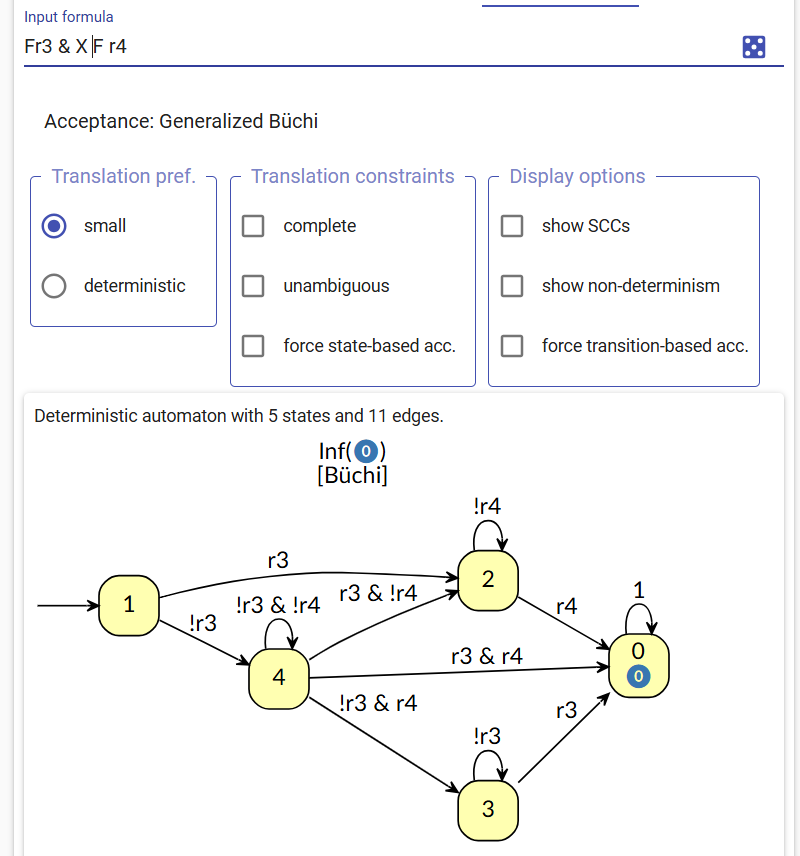

# LTL2Buchi

- task保存在task.py备份
- 使用网址 https://spot.lre.epita.fr/app/ 转换，acceptance 选择 state-based / Generalized，复制HOA代码出来
- 保存在此文件夹下，文件名为顺序/编号，添加 "Label: xx"在 "--BODY--" 之前
### 0

### 1

### 2

### 3

以下是一个错误的示例， X出现在了最外层，错误原因：？

